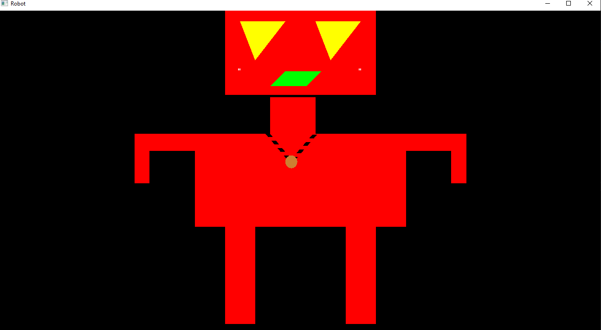

# OpenGL-Robot
 A C++ code to draw a 2D robot using openGL and apply some geometric transformations on it using keyboard
 
- A - Move left
- D - Move right
- S - Scale

- No configuration is needed. Just uncompress the Glew and Glut.zip in the OpenGL-Robot folder before opening the project and everything should work

